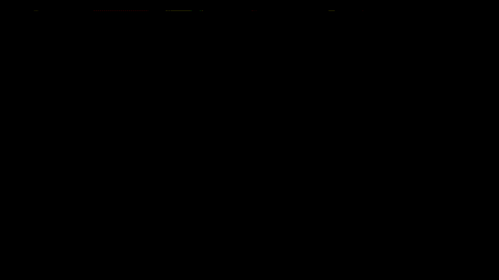

    ▄▄▄▄      ▄▄▄▄▄▄▄▄▄▄▄  ▄▄▄▄▄▄▄▄▄▄▄  ▄▄▄▄▄▄▄▄▄▄▄ 
  ▄█░░░░▌    ▐░░░░░░░░░░░▌▐░░░░░░░░░░░▌▐░░░░░░░░░░░▌
 ▐░░▌▐░░▌    ▐░█▀▀▀▀▀▀▀█░▌▐░█▀▀▀▀▀▀▀█░▌▐░█▀▀▀▀▀▀▀▀▀ 
  ▀▀ ▐░░▌    ▐░▌       ▐░▌▐░▌       ▐░▌▐░█▄▄▄▄▄▄▄▄▄ 
     ▐░░▌    ▐░█▄▄▄▄▄▄▄█░▌▐░█▄▄▄▄▄▄▄█░▌▐░░░░░░░░░░░▌
     ▐░░▌    ▐░░░░░░░░░░░▌▐░░░░░░░░░░░▌ ▀▀▀▀▀▀▀▀▀█░▌
     ▐░░▌     ▀▀▀▀▀▀▀▀▀█░▌ ▀▀▀▀▀▀▀▀▀█░▌          ▐░▌
     ▐░░▌              ▐░▌          ▐░▌          ▐░▌
 ▄▄▄▄█░░█▄▄▄  ▄▄▄▄▄▄▄▄▄█░▌ ▄▄▄▄▄▄▄▄▄█░▌ ▄▄▄▄▄▄▄▄▄█░▌
▐░░░░░░░░░░░▌▐░░░░░░░░░░░▌▐░░░░░░░░░░░▌▐░░░░░░░░░░░▌
 ▀▀▀▀▀▀▀▀▀▀▀  ▀▀▀▀▀▀▀▀▀▀▀  ▀▀▀▀▀▀▀▀▀▀▀  ▀▀▀▀▀▀▀▀▀▀▀ 
                                                    
Nikon:  I want it.
Phreak: I want it to have my children!
Cereal: Yeah, I bet it looks crispy in the dark.
Phreak: Yo hit the lights!

This project started as an attempt to complete the work started 
[here](https://github.com/germ/HACKERS-1995-BOOTSPLASH), as interesting as
these scenes were, they weren't accurate to the movie.

Luckily, someone else decided they *also* wanted to create more accurate
boot screens from the movie based on [this scene](https://www.youtube.com/watch?v=qiQlZU5oWTQ 

I took those videos and with FFMPEG and pngquant converted th 
em to PNGs and wrote Plymouth scripts to use that as boot screens. 

### CrashOverride


### AcidBurn


### Lord Nikon


### Cereal Killer




# Instalation

If you're running Ubuntu you can run the install script `./install.sh`

Otherwise you'll need to:

Copy the themes:

```bash
sudo cp -rv cerealkiller /usr/share/plymouth/themes
sudo cp -rv lordnikon /usr/share/plymouth/themes
sudo cp -rv acidburn /usr/share/plymouth/themes
sudo cp -rv crashoverride /usr/share/plymouth/themes
```

Install the themes in Plymouth:

```bash
sudo update-alternatives --install /usr/share/plymouth/themes/default.plymouth default.plymouth /usr/share/plymouth/themes/cerealkiller/cerealkiller.plymouth 107
sudo update-alternatives --install /usr/share/plymouth/themes/default.plymouth default.plymouth /usr/share/plymouth/themes/lordnikon/lordnikon.plymouth 108
sudo update-alternatives --install /usr/share/plymouth/themes/default.plymouth default.plymouth /usr/share/plymouth/themes/acidburn/acidburn.plymouth 109
sudo update-alternatives --install /usr/share/plymouth/themes/default.plymouth default.plymouth /usr/share/plymouth/themes/crashoverride/crashoverride.plymouth 106
```

Select the theme you want:

```bash
sudo update-alternatives --config default.plymouth 
```

And update initramfs: `sudo update-initramfs -u`

## Help the animation is too big/small

We need to figure out which resolution Plymouth is running as. TO make 
figuring this out easier I've create a theme called 'Resolution'. Install 
that theme using the commands below, and make note of the number on the screen. 

```bash
sudo cp -rv resolution /usr/share/plymouth/themes
sudo update-alternatives --install /usr/share/plymouth/themes/default.plymouth default.plymouth /usr/share/plymouth/themes/resolution/resolution.plymouth 110
sudo update-alternatives --config default.plymouth 
sudo update-initramfs -u
```

Once you have that number run the script `./generate.sh` and pass it the theme and the number. 

For example, if the number was 480 and you want to use the LordNikon theme:

`./generate.sh lordnikon 480`

Then you can copy and install the theme as above. 

## Help the animation is too fast

Plymouth runs at 50 frames a second, that might make scenes run too fast. To
change the animation speed you edit the script file for the theme you're using and
change `speed=1` to `speed=2`, or `speed=3`, etc. This determines how many frames
to linger on a frame.


